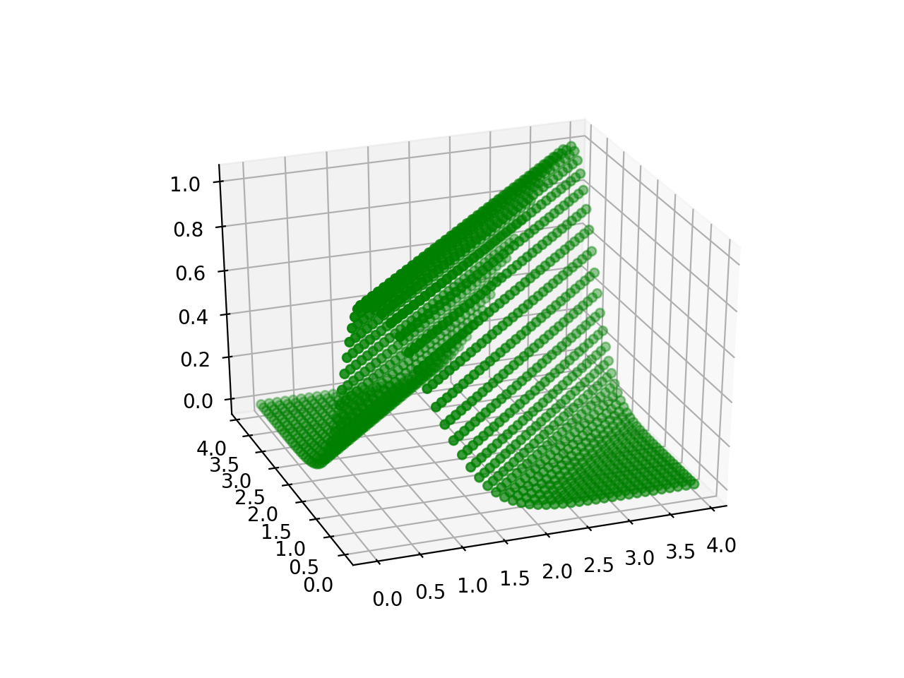
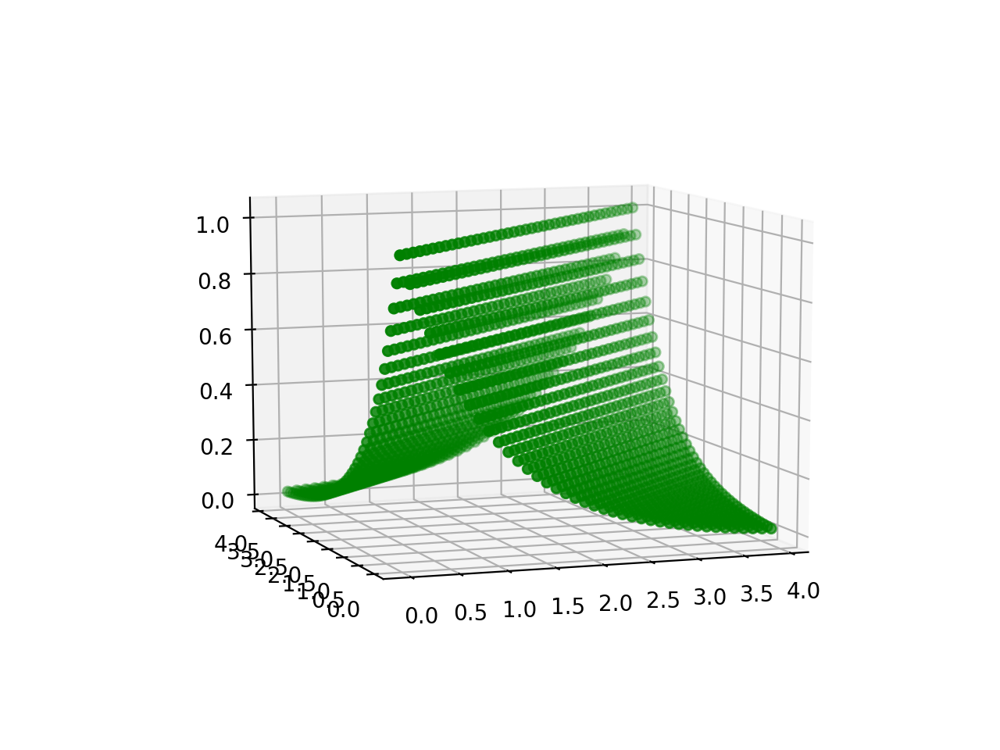
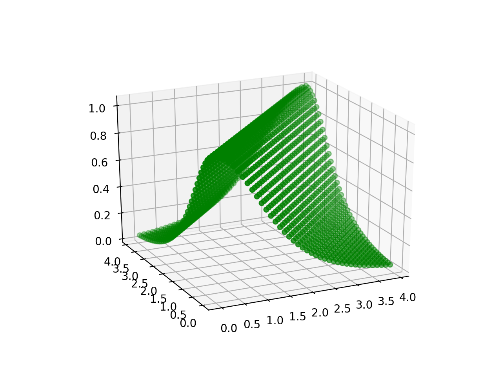
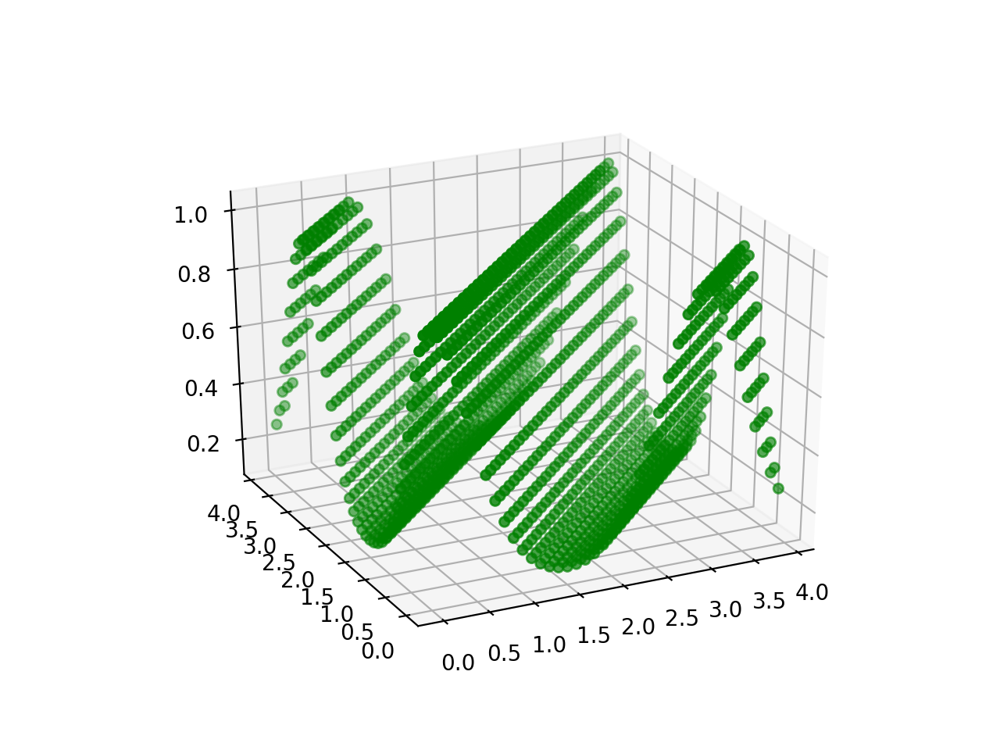

# kernels visualizations

## Squared exponential kernel
* l=1  

## Orstein Uhlenbeck kernel
* l=1  

## Rational quadratic kernel
* l=1
* sigma=1
* alpha=2  

## Periodic kernel
* l=1
* sigma=1
* p=3  

## Polynomial kernel
* sigmab=2
* sigmav=2
* mu=1
* alpha=2  
